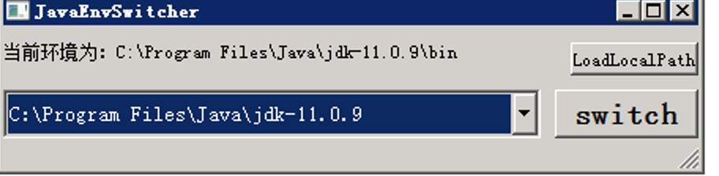
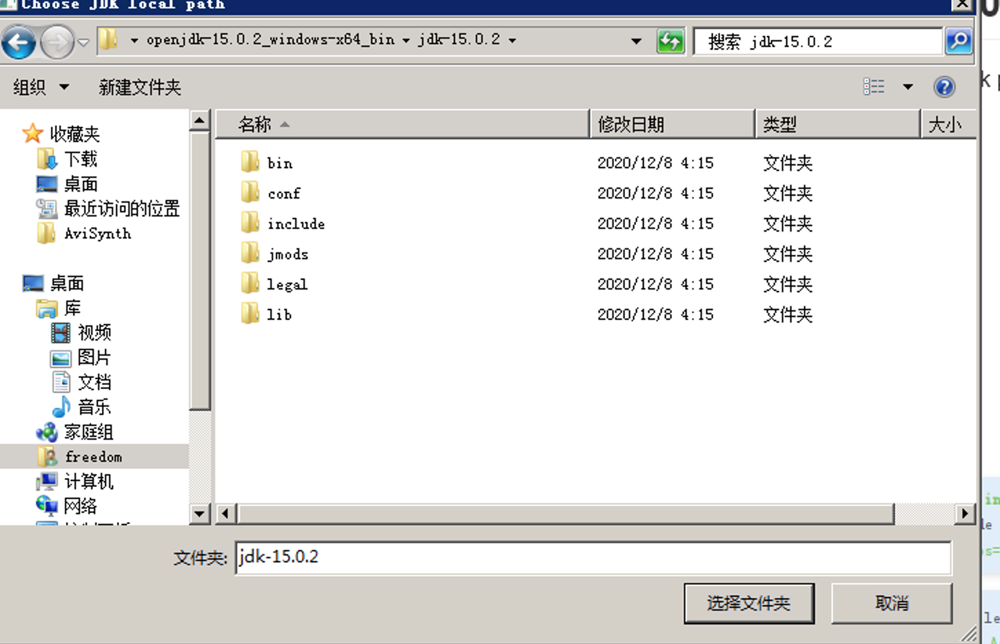
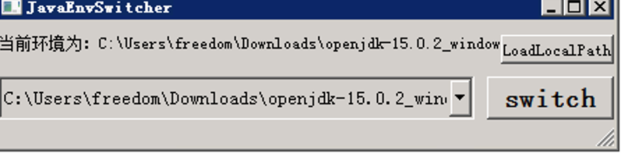

# JavaEnvSwitcher
an easy jdk switch tool for windows

--- 

 - [x] test on windows 7
 - [ ] test on windows  10
--- 


## version 0.1.1.0
support local jdk path,like openjdk





自行打包命令
```shell script
nuitka --mingw64 --standalone  --windows-disable-console --output-dir=bin --show-progress --show-memory --plugin-enable=qt-plugins  --windows-product-version=0.1.1.0 --windows-company-name=github.com/p1ay8y3ar --windows-uac-admin  --windows-icon-from-ico=source\logo\logo.ico JavaEnvSwitcher.py

```